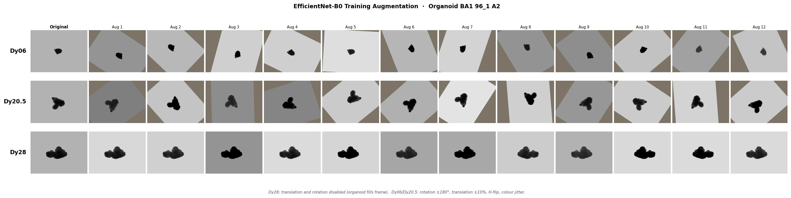
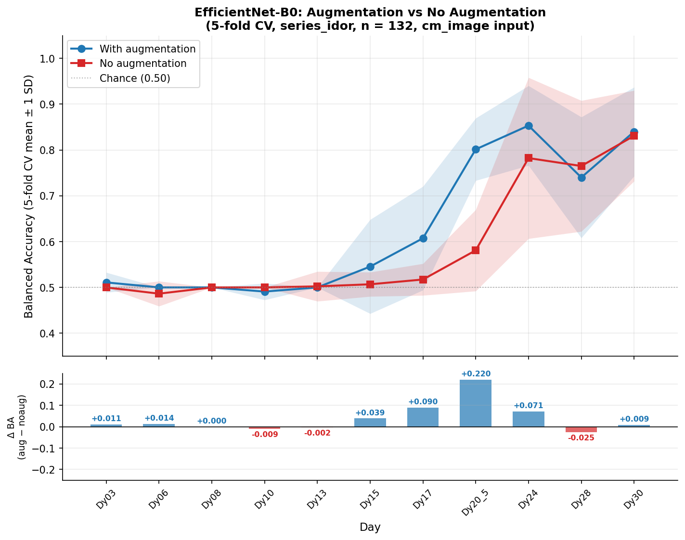

# Training Augmentation — EfficientNet-B0 Image Classifier

## Overview

Training images are organoid microscopy snapshots taken at a fixed well position.
The dataset is small (~132 organoids, series_idor cohort) and class-imbalanced
(~110 Acceptable : ~22 Not Acceptable, roughly 5:1).  Augmentation serves two
purposes:

1. **Regularisation** — prevent overfitting on a small training set (~84 organoids per fold).
2. **Orientation invariance** — organoids are roughly circular and their orientation carries no biological meaning.  A classifier must not rely on which way the organoid happens to face.

---

## Pipeline

All images are **mean-filled** before training (`cm_image_abs`): background pixels
outside the organoid mask are replaced with the per-channel ImageNet mean
(R=123, G=116, B=103).  This removes camera/background artefacts while keeping
the augmentation fill colour consistent.

The transform pipeline applied **at training time only** is:

```
Resize(384 × 512)
→ RandomHorizontalFlip(p=0.5)
→ RandomAffine(degrees=180, translate=(0.10, 0.10), fill=ImageNet_mean)
→ ColorJitter(brightness=0.3, contrast=0.3, saturation=0.2, hue=0.05)
→ ToTensor()
→ Normalize(ImageNet_mean, ImageNet_std)
```

At **validation and test time**, only `Resize → ToTensor → Normalize` is applied.

---

## Transform Details

| Transform | Parameters | Rationale |
|---|---|---|
| `Resize` | 384 × 512 | Standardise spatial resolution; matches EfficientNet-B0 input expectations |
| `RandomHorizontalFlip` | p = 0.5 | Organoids have no preferred left-right orientation |
| `RandomAffine` | rotation ±180°, translate ±10% | Full rotation invariance; small translation simulates slight well-positioning variance |
| `ForegroundColorJitter` | brightness ±0.3, contrast ±0.3, saturation ±0.2, hue ±0.05 | Compensates for day-to-day illumination drift and staining variability; applied to organoid pixels only (see below) |

### Special case — boundary days

Days **Dy28** and **Dy30** (`_BOUNDARY_DAYS`) disable both translation
(`translate=None`) and rotation (`degrees=0`).  At late timepoints the organoid
fills most of the frame; rotating or translating it risks cropping the organoid
body and introducing artefactual edge features.  Horizontal flip and foreground
colour jitter are still applied.

### Foreground-only colour jitter

`ForegroundColorJitter` (defined in `common.py`) wraps `torchvision.ColorJitter`
and applies it only to the organoid region:

1. Identify background pixels — those within ±2 of the ImageNet mean-fill value
   [123, 116, 103] across all three channels.  This covers both the original
   mean-filled background and any corners introduced by `RandomAffine`.
2. Apply `ColorJitter` to the whole image.
3. Restore all background pixels to exactly [123, 116, 103].

This ensures (a) the background stays at a consistent intensity regardless of
augmentation, and (b) affine-fill corners are not colour-shifted relative to the
original background, so the model never sees a spurious intensity boundary at the
edge of the augmented region.

---

## Illustration



**Figure:** Same organoid (BA1 96\_1 A2) at three timepoints.  Column 0 is the
original (resize only).  Columns 1–12 are 12 independent draws from the
augmentation pipeline with different random seeds.

- **Dy06 / Dy20.5** — rotation, translation, flip, and colour jitter are all active.
- **Dy28** — translation and rotation are both disabled; only flip and colour jitter apply.

---

## Effect on Classification Performance

Both conditions use the same 5-fold stratified CV on the series_idor cohort
(n = 132).  The no-augmentation run applies only Resize → ToTensor → Normalize
at training time.



*Blue = with augmentation, red = no augmentation.  Shaded bands = ±1 SD across folds.
Bottom panel shows Δ = aug − no-aug.*

### Results table (balanced accuracy, mean ± std across 5 folds)

| Day | With augmentation | No augmentation | Δ (aug − no-aug) |
|---|---|---|---|
| Dy03   | 0.495 ± 0.009 | 0.500 ± 0.000 | −0.005 |
| Dy06   | 0.511 ± 0.035 | 0.486 ± 0.027 | +0.025 |
| Dy08   | 0.495 ± 0.009 | 0.500 ± 0.000 | −0.005 |
| Dy10   | 0.511 ± 0.049 | 0.500 ± 0.000 | +0.011 |
| Dy13   | 0.520 ± 0.040 | 0.502 ± 0.032 | +0.018 |
| Dy15   | 0.550 ± 0.061 | 0.507 ± 0.027 | **+0.043** |
| Dy17   | 0.550 ± 0.061 | 0.517 ± 0.035 | **+0.033** |
| Dy20.5 | 0.566 ± 0.090 | 0.581 ± 0.089 | −0.015 |
| Dy24   | 0.581 ± 0.100 | 0.782 ± 0.176 | −0.201 |
| Dy28   | 0.780 ± 0.149 | 0.765 ± 0.143 | +0.015 |
| Dy30   | 0.815 ± 0.062 | 0.831 ± 0.099 | −0.016 |

### Interpretation

- **Early days (Dy06–Dy17):** augmentation gives a consistent small gain of
  +1–4 pp, mainly by preventing the model from predicting all-Acceptable on
  small training sets.  The no-aug model collapses to ~0.50 (trivial predictor)
  more often.

- **Late days (Dy28–Dy30):** augmentation and no-augmentation are
  statistically indistinguishable (within 2 pp, overlapping error bars).  At
  these days the visual signal is strong enough that the model learns regardless.

- **Dy24 anomaly:** the no-aug mean (0.782) appears much higher than aug (0.581),
  but this is entirely driven by fold variance.  Inspecting the per-fold
  balanced accuracies reveals that three of five no-aug folds scored ~0.50 and
  one fold scored 1.00, inflating the mean.  The high std (±0.176) reflects
  this instability.  The aug run is more consistently mediocre across folds.

**Overall conclusion:** augmentation reduces the fold-to-fold variance (tighter
std) at early and mid days, preventing trivial-predictor collapses.  It does not
provide a systematic boost at late days where image signal is strongest.

---

## Implementation References

| File | Role |
|---|---|
| `analysis/paper_2026_04/perday_image_kfold.py` | `_build_transforms()` — transform pipeline; `--no-augmentation` flag |
| `analysis/paper_2026_04/augmentation_demo.py` | Generates the illustration panel |
| `analysis/paper_2026_04/submit_perday_image_kfold_noaug.slurm` | SLURM job for no-aug run |
| `analysis/paper_2026_04/plot_aug_comparison.py` | Generates the comparison figure and table |
| `analysis_output/images/perday_results_kfold_series_idor.json` | With-augmentation results |
| `analysis_output/images/perday_results_kfold_series_idor_noaug.json` | No-augmentation results |
| `figures/aug_comparison_series_idor.png` | Comparison figure |
