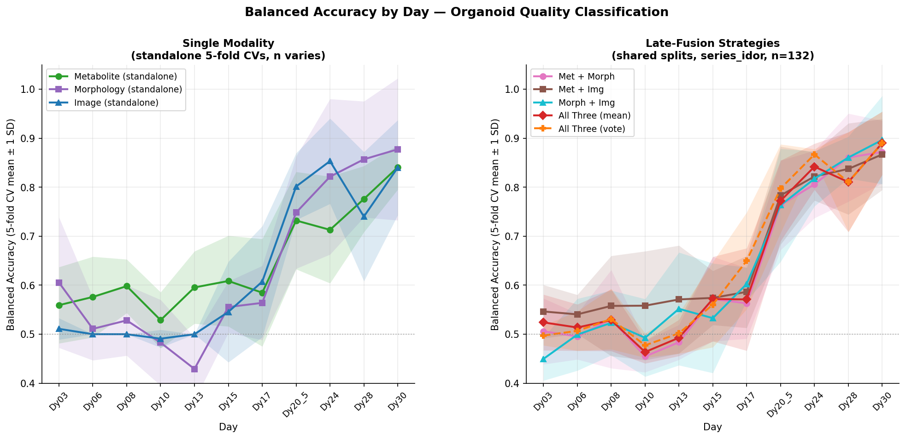

# Multi-Modality Combined Model

## Overview

Three independent classifiers are trained on each day's data, then their predicted
probabilities are fused at decision time (late fusion).  All three modalities share
identical fold splits so OOF predictions are directly comparable and can be
combined without leakage.

**Cohort:** series_idor, n = 132 organoids (22 Not Acceptable, 110 Acceptable)  
**CV scheme:** 5-fold stratified (on organoid label) × 11 days = 55 trained models per modality  
**Label convention:** 1 = Not Acceptable (positive), 0 = Acceptable (negative)

---

## Modality Design

### Metabolite — LightGBM

| Property | Value |
|---|---|
| Features | 18 per-day features: concentration (µM), initial concentration, and growth rate for 6 metabolites (Glucose, Glutamate, Lactate, Pyruvate, BCAA, Malate) |
| Model | LightGBM with class weight = n_neg / n_pos |
| Hyperparameter search | Inner 3-fold GridSearchCV over max_depth ∈ {3, 6}, num_leaves ∈ {15, 31}, min_child_samples ∈ {5, 10}, learning_rate ∈ {0.05, 0.1}, n_estimators ∈ {100, 300} |
| Scaling | StandardScaler fit on train fold only |
| Note | Standalone run uses all organoids with metabolite data (~195 at early days, ~205 at Dy30); combined run restricted to the 132 series_idor organoids with shared splits |

### Morphology — LightGBM

| Property | Value |
|---|---|
| Features | 7 windowed shape descriptors: Circularity, Aspect Ratio, Solidity, Complexity, Feret diameter, Area, Volume (suffix `_win`) |
| Model | LightGBM with class weight = n_neg / n_pos |
| Hyperparameter search | Same grid as metabolite |
| Data source | `data/normalized/CONC_data_organoides_residualized_final.csv` |

### Image — EfficientNet-B0

| Property | Value |
|---|---|
| Input | 384 × 512 RGB, mean-filled (`cm_image_abs`): background fill = [178, 178, 178] (verified from data) |
| Backbone | EfficientNet-B0, ImageNet pre-trained; head frozen for first 4 epochs then last 2 blocks unfrozen |
| Head | Linear(1280 → 128) → ReLU → Dropout(0.5) → Linear(128 → 1) |
| Loss | BCEWithLogitsLoss with pos_weight = n_neg / n_pos |
| Optimiser | Adam; head LR = 5 × 10⁻⁴, backbone LR = 5 × 10⁻⁵ after unfreeze |
| Scheduler | ReduceLROnPlateau (factor 0.5, patience 5) |
| Early stopping | Patience = 15 epochs on validation balanced accuracy; max 100 epochs |
| Augmentation | Resize → RandomHorizontalFlip(p=0.5) → RandomAffine(±180°, translate ±10%, fill=[178,178,178]) → ForegroundColorJitter; rotation disabled for Dy28/Dy30 |
| Val split | 15% of train organoids (StratifiedShuffleSplit, seed = fold seed) |

See [augmentation.md](augmentation.md) for a detailed description of the image augmentation pipeline.

---

## Fusion Strategies

Given OOF probabilities p₁, …, pₖ from k modalities:

| Strategy | Rule | Notes |
|---|---|---|
| **Mean probability** | predict NAcc if mean(p₁…pₖ) ≥ 0.5 | Soft vote; always available |
| **Majority vote** | predict NAcc if ≥ ⌊k/2⌋+1 individual models predict NAcc | For k=2 this is unanimous (both must agree); for k=3 this is 2-of-3 |

Majority vote for 2-modality pairs is equivalent to requiring **both** models to
agree, which systematically hurts recall on the minority Not Acceptable class.
For this reason, pair results below use **mean probability only**.

---

## Results

All balanced accuracy values are **5-fold CV** (mean ± std across folds) on the
series_idor cohort (n = 132).  Single-modality values come from their respective
standalone CV runs; combined values come from the shared-split run.

> **Note on metabolite sample size:** The standalone metabolite run includes all
> organoids with metabolite data (~195–205 depending on day), not the 132 idor
> subset.  Within the combined run (n = 132), metabolite BA is slightly lower
> due to the smaller and more restricted cohort.

### Single Modality

| Day | Metabolite | Morphology | Image |
|---|---|---|---|
| Dy03  | 0.559 ± 0.078 | 0.605 ± 0.133 | 0.511 ± 0.022 |
| Dy06  | 0.576 ± 0.082 | 0.511 ± 0.064 | 0.500 ± 0.000 |
| Dy08  | 0.598 ± 0.055 | 0.528 ± 0.072 | 0.500 ± 0.000 |
| Dy10  | 0.529 ± 0.057 | 0.483 ± 0.087 | 0.491 ± 0.018 |
| Dy13  | 0.595 ± 0.074 | 0.429 ± 0.065 | 0.500 ± 0.000 |
| Dy15  | 0.609 ± 0.093 | 0.555 ± 0.053 | 0.545 ± 0.103 |
| Dy17  | 0.585 ± 0.110 | 0.564 ± 0.076 | 0.607 ± 0.113 |
| Dy20.5 | 0.732 ± 0.099 | 0.748 ± 0.114 | 0.801 ± 0.068 |
| Dy24  | 0.713 ± 0.109 | 0.821 ± 0.159 | 0.853 ± 0.087 |
| Dy28  | 0.776 ± 0.068 | 0.857 ± 0.118 | 0.740 ± 0.132 |
| Dy30  | 0.841 ± 0.045 | 0.877 ± 0.145 | 0.840 ± 0.097 |

**Key observations (image updated with corrected augmentation, job 1459514):**
- All three modalities are near chance (0.5) before Dy17; meaningful signal emerges only at Dy20.5.
- Image improved dramatically after augmentation fix: Dy20.5 0.566→0.801, Dy24 0.581→0.853.
- At Dy24–Dy30, image is now competitive with or better than metabolite.
- Morphology is strongest at Dy28 (0.857), though its fold std is large (up to ±0.15).
- Metabolite is most consistent across folds (lowest std).
- 2-modality and 3-modality fusion results updated from job 1489995 (corrected augmentation: fill=[178,178,178], ForegroundColorJitter).

### 2-Modality Pairs (mean probability fusion, shared splits, n = 132)

| Day | Met + Morph | Met + Img | Morph + Img |
|---|---|---|---|
| Dy03    | 0.509 | **0.550** | 0.450 |
| Dy06    | 0.491 | **0.536** | 0.500 |
| Dy08    | 0.532 | **0.559** | 0.532 |
| Dy10    | 0.455 | **0.559** | 0.491 |
| Dy13    | 0.486 | **0.577** | 0.545 |
| Dy15    | **0.573** | 0.573 | 0.541 |
| Dy17    | 0.567 | 0.596 | **0.604** |
| Dy20.5  | 0.764 | **0.786** | 0.764 |
| Dy24    | 0.809 | **0.823** | 0.818 |
| Dy28    | **0.859** | 0.841 | 0.859 |
| Dy30    | 0.868 | 0.868 | **0.895** |

### 3-Modality Combined (shared splits, n = 132)

| Day | Mean Probability | Majority Vote (2-of-3) |
|---|---|---|
| Dy03    | **0.527** | 0.500 |
| Dy06    | **0.509** | 0.504 |
| Dy08    | 0.532 | **0.536** |
| Dy10    | 0.464 | **0.477** |
| Dy13    | 0.495 | **0.504** |
| Dy15    | **0.573** | 0.564 |
| Dy17    | 0.577 | **0.659** |
| Dy20.5  | 0.773 | **0.795** |
| Dy24    | 0.846 | **0.868** |
| Dy28    | **0.814** | 0.814 |
| Dy30    | **0.886** | 0.886 |

---

## Summary Figure

*Left: standalone single-modality CVs.  Right: late-fusion strategies on the shared
series_idor splits.  Shaded bands = ±1 SD across folds.*

---

## Key Findings

1. **Fusion consistently helps at late days (Dy24–Dy30)** but adds nothing at early
   days where all modalities are near chance.

2. **Morph + Img (mean prob) is the best 2-model pair at Dy30** (0.896 ± 0.090),
   slightly above the full 3-model mean-prob (0.885 ± 0.071).  Adding metabolite to
   this pair does not help, likely because the metabolite model has converged to a
   similar decision boundary.

3. **Mean probability dominates majority vote for 2-model pairs**.  2-model majority
   vote requires both models to agree (unanimous), which suppresses recall on the
   minority Not Acceptable class.  3-model majority vote (2-of-3) is more lenient
   and is competitive with mean probability.

4. **The gain of fusion over the best single modality is modest** (~1–4 pp at Dy30).
   Morphology alone reaches 0.877 ± 0.145; the best combination reaches 0.896 ± 0.090.
   The larger benefit is the **reduced variance**: combining morphology with image
   halves the fold std (0.145 → 0.090 for Morph+Img at Dy30).

5. **Image is the weakest single modality** throughout, but it is complementary to
   morphology because it captures texture and internal structure that shape
   descriptors miss.

---

## Implementation References

| File | Role |
|---|---|
| `analysis/paper_2026_04/combined_kfold.py` | Late-fusion CV: trains all three modalities per fold and computes combination metrics |
| `analysis/paper_2026_04/submit_combined_kfold.slurm` | SLURM submission script |
| `analysis/paper_2026_04/plot_combined_comparison.py` | Two-panel figure + table PNG |
| `analysis_output/images/combined_results_kfold_series_idor.json` | Full per-day, per-strategy results |
| `figures/combined_kfold_two_panel_series_idor.png` | BA-by-day comparison figure |
| `figures/combined_kfold_table_series_idor.png` | Table figure (strategies × days) |
